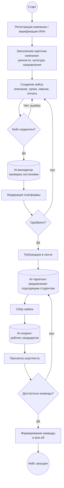
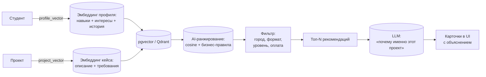
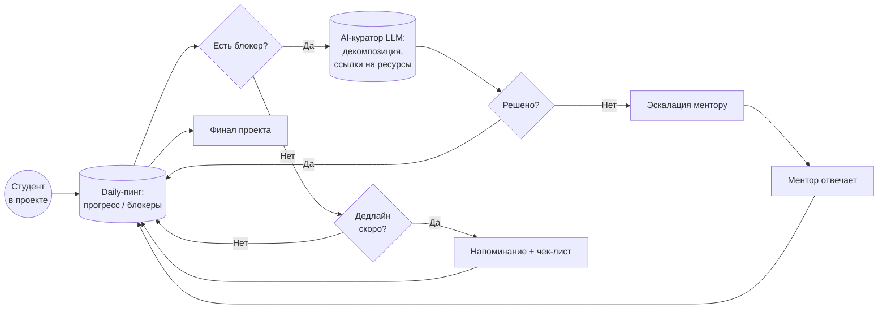
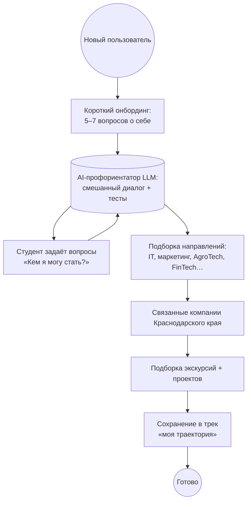
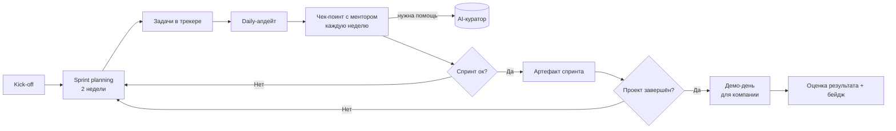
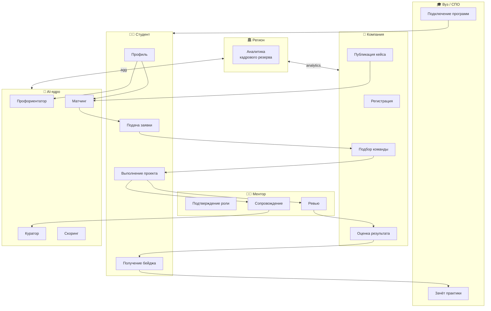

# 02. BPMN-диаграммы ключевых процессов

> Нотация BPMN 2.0 (упрощённая, в Mermaid `flowchart`).
> Все диаграммы рендерятся в GitHub, на сайте Mermaid Live Editor и в любом BPMN-просмотрщике, импортирующем Mermaid.
> Дополнительно PNG-версии лежат в `docs/diagrams/`.

Используемые элементы:

| Обозначение | BPMN | Mermaid |
|---|---|---|
| Старт / Конец | Event (Start / End) | `((Старт))` / `((Конец))` |
| Задача (Task) | Прямоугольник | `[Задача]` |
| Развилка (Gateway) | Ромб | `{Условие?}` |
| Подпроцесс | Прямоугольник с «+» | `[[Подпроцесс]]` |
| AI-сервис | Системная задача | `[(AI: ...)]` |
| Дорожка (Swimlane) | Pool / Lane | `subgraph` |

---

## 2.1. Процесс «Студент → проект → завершение»

Главный сквозной процесс блока **B**. Показывает путь молодого человека от регистрации до получения подтверждённого опыта.

```mermaid
flowchart LR
    subgraph S["Дорожка: Студент"]
        A((Старт)) --> A1[Регистрация / логин через ВК / Госуслуги]
        A1 --> A2[Заполнение цифрового профиля:<br/>вуз, курс, интересы, навыки]
        A2 --> A3[(AI-профориентатор:<br/>анкета + чат)]
        A3 --> A4[Получение карьерной траектории<br/>и подборки направлений]
        A4 --> A5[Просмотр ленты проектов]
    end

    subgraph M["AI-сервисы"]
        AI1[(AI-матчинг:<br/>профиль ↔ проект)]
        AI2[(AI-куратор:<br/>советы, дедлайны)]
        AI3[(AI-ревью:<br/>оценка артефактов)]
    end

    subgraph C["Дорожка: Компания / Ментор"]
        C1[Публикация кейса]
        C2{Заявка студента?}
        C3[Просмотр кандидатов + AI-скоринг]
        C4[Приглашение в команду]
        C5[Постановка задач, чек-поинты]
        C6[Финальное ревью]
        C7[Решение: оффер / резерв / отказ]
    end

    A5 --> AI1
    AI1 --> A6[Топ-5 подходящих проектов]
    A6 --> A7[Подача заявки]
    A7 --> C2
    C1 -.-> AI1
    C2 -->|Да| C3
    C2 -->|Нет| A5
    C3 --> C4
    C4 --> A8[Принятие приглашения]
    A8 --> A9[[Выполнение проекта<br/>2–8 недель]]
    A9 --> AI2
    AI2 --> A9
    A9 --> A10[Загрузка артефактов / отчёта]
    A10 --> AI3
    AI3 --> C6
    C5 --> C6
    C6 --> C7
    C7 --> A11[Цифровой бейдж + запись в портфолио]
    A11 --> Z((Конец))
```

---

## 2.2. Процесс «Компания: публикация кейса и подбор команды»

---

## 2.3. Процесс «AI-матчинг студента и проекта»

> Сценарий ИИ № 1 — основа продуктовой ценности.

**Что под капотом:**

1. **Embeddings:** `sentence-transformers` (или e5-large) поверх описаний.
2. **Хранилище:** `pgvector` в основной БД PostgreSQL.
3. **Ранжирование:** cosine similarity × бизнес-веса (приоритет региона КК, доступность по времени, оплата).
4. **Объяснимость:** мини-промпт к LLM («Объясни студенту, почему этот проект ему подходит, на основе совпавших навыков»).

---

## 2.4. Процесс «AI-куратор сопровождает студента»

> Сценарий ИИ № 2 — удержание и завершаемость.

---

## 2.5. Процесс «AI-профориентатор для новичков»

> Сценарий ИИ № 3 — точка входа.

---

## 2.6. Процесс «Командная работа над проектом»

---

## 2.7. Сквозная карта взаимодействий ролей

---

## 2.8. Замечания по реализации BPMN

- В MVP реализуются процессы **2.1, 2.2, 2.3, 2.5**.
- Процесс **2.4 (AI-куратор)** — частично (только чат + напоминания).
- Процессы **2.6, 2.7** — описаны как контракт между микросервисами; ниже см. файл `03-architecture.md`.
