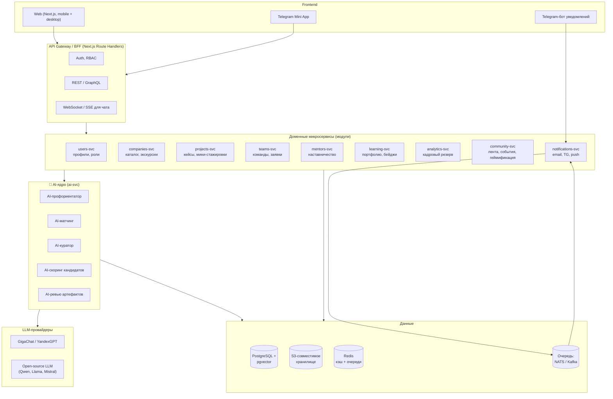
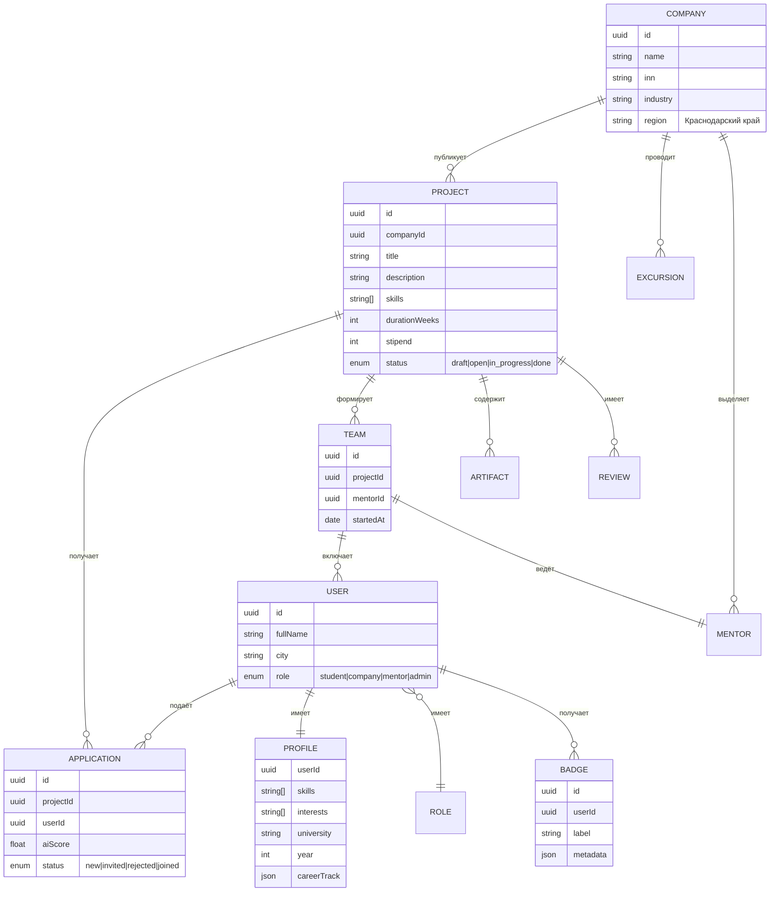

# 03. Архитектура решения

> Платформа **«ПроКубань»** — единая цифровая экосистема знакомства молодёжи Краснодарского края с компаниями региона через **проекты и мини-стажировки**.

---

## 3.1. Высокоуровневая архитектура

### Принципы
- **Микросервисы вокруг доменов**, общающиеся через REST + асинхронные события.
- **AI-ядро как отдельный сервис**, не «чат сбоку», а контракт-ориентированные функции (`match()`, `score()`, `recommend()`).
- **Российский стек** (Yandex Cloud / VK Cloud / Selectel; GigaChat / YandexGPT).
- **152-ФЗ:** обработка персональных данных в РФ; согласие при регистрации; маскирование для AI-промптов.
- **MVP:** монолит-Next.js на Vercel + один сервис AI; модули в коде разделены, но деплой — единый.

---

## 3.2. Доменная модель (упрощённо)

---

## 3.3. Модули как микросервисы (роадмап)

| Сервис | Что делает | MVP | После MVP |
|---|---|---|---|
| `users-svc` | Регистрация, профили, RBAC, согласия | ✅ | OAuth-провайдеры, цифровое портфолио |
| `companies-svc` | Каталог компаний, страницы | ✅ (статика) | Динамические страницы, медиа |
| `projects-svc` | CRUD кейсов, фильтры | ✅ | Биллинг, шаблоны |
| `teams-svc` | Заявки, команды, чек-поинты | ✅ | Канбан, видеозвонки |
| `mentors-svc` | Профили менторов, расписание | частично | Маркетплейс менторов |
| `learning-svc` | Бейджи, портфолио, треки | частично | Интеграция с вузами, дипломы |
| `analytics-svc` | Дашборды для компаний и региона | частично | BI-кубы, экспорт |
| `community-svc` | Лента активности, геймификация | — | Челленджи, рейтинги, события |
| `notifications-svc` | Email / TG / push | ✅ (TG-бот) | Гибкие триггеры |
| `ai-svc` | Все AI-функции | ✅ | Доменные fine-tuned-модели |

---

## 3.4. AI-ядро

### 3.4.1. Сценарии ИИ

Минимум 5 сценариев, минимум 3 — продуктовые:

| # | Сценарий | Тип модели | Когда срабатывает |
|---|---|---|---|
| 1 | **AI-профориентатор** | LLM (GigaChat / YandexGPT) + structured output | Онбординг, «помоги выбрать профессию» |
| 2 | **AI-матчинг студент ↔ проект** | Embeddings (e5 / multilingual-e5) + cosine + бизнес-правила | Каждый раз, когда студент открывает ленту проектов |
| 3 | **AI-куратор** | LLM + RAG по базе знаний (методички, FAQ) | Во время выполнения проекта (чат, напоминания) |
| 4 | **AI-скоринг заявок** | Embeddings + классификатор + LLM-эксплейнер | Компания смотрит шортлист |
| 5 | **AI-ревью артефактов** | LLM + правила | Студент сдаёт результат, ментор получает черновик ревью |

### 3.4.2. Стек

- **LLM API:** GigaChat (Sberbank), YandexGPT (Yandex Cloud), GPT-OSS / Qwen2.5 для self-hosted fallback.
- **Embeddings:** `intfloat/multilingual-e5-large` (open-source, локально через `sentence-transformers`).
- **Векторное хранилище:** `pgvector` в PostgreSQL.
- **Оркестрация:** простой Python-сервис (FastAPI) или Next.js Route Handler с `openai`-совместимым клиентом (GigaChat и YandexGPT предоставляют OpenAI-совместимые эндпоинты).
- **Защита от инъекций:** системные промпты, sanitization, rate-limit, логирование.
- **Приватность:** маскирование ФИО / телефонов перед отправкой в LLM.

### 3.4.3. Как именно ИИ влияет на UX

| Точка | Без ИИ (рынок сегодня) | С ИИ (наша платформа) |
|---|---|---|
| Поиск проектов | Ключевые слова, фильтры | Лента, отсортированная под профиль, с объяснением «почему этот проект» |
| Подбор кандидата | HR смотрит вручную | Готовый шортлист с пояснением, какие навыки совпали |
| Помощь во время проекта | Никакой | Куратор-бот, разбирает блокеры, предлагает шаги |
| Профориентация | Тест из 100 вопросов | Диалог 5 мин, выдаёт траекторию + проекты + экскурсии |
| Оценка результата | Субъективная | AI-черновик ревью + красные флаги |

### 3.4.4. Данные, которые анализирует ИИ

- Профиль студента: навыки, интересы, история проектов, вуз, курс.
- Карточка проекта: текст, требуемые навыки, индустрия, оплата, сроки.
- Поведенческие сигналы: что смотрел, что лайкал, что бросил.
- Внешние знания: РАГ-база по профессиям, индустрии, региональным компаниям.

---

## 3.5. Технологический стек MVP

| Слой | Технология | Почему |
|---|---|---|
| Frontend | **Next.js 14 (App Router) + React 18 + TypeScript** | SSR, edge, RSC, скорость разработки |
| Стили | **Tailwind CSS** + **shadcn/ui** (Radix) | Быстрая сборка качественного UI |
| Анимации / графики | Framer Motion, Recharts | UX, аналитика |
| API | **Next.js Route Handlers** (BFF) | Один деплой, простая интеграция |
| База данных | **PostgreSQL + pgvector** | RDBMS + векторы в одном |
| ORM | Prisma | Типобезопасность |
| Очереди / события | NATS / Redis Streams | Простая интеграция |
| Хранилище файлов | S3-совместимое (Yandex Object Storage) | Артефакты, фото компаний |
| Аутентификация | NextAuth.js + Госуслуги / VK ID (на проде) | Доверие |
| LLM | GigaChat / YandexGPT (OpenAI-совместимый API) | 152-ФЗ |
| Деплой | Vercel / Yandex Cloud | Быстрый старт |
| Мониторинг | Sentry, Posthog | Аналитика и ошибки |

---

## 3.6. Безопасность и соответствие

- **152-ФЗ:** хостинг и БД в РФ; согласие при регистрации; роль «школьник» — согласие родителя.
- **Возрастные ограничения:** контент для 14–24.
- **Модерация контента:** ручная + LLM-классификатор по правилам платформы.
- **Логи AI-промптов:** отдельная шифрованная БД, обезличивание.
- **Антифрод:** капча на регистрации, верификация компании по ИНН, повторное использование email не позволяет создать «фейковую» команду.

---

## 3.7. Этапы развития

| Этап | Срок | Цель |
|---|---|---|
| **MVP-1 (хакатон)** | 12 ч | Лента проектов, профиль, заявка, AI-чат, AI-матчинг |
| **MVP-2** | 1 мес | Команды, чек-поинты, портфолио, дашборд компании |
| **Пилот в Краснодаре** | 3 мес | 5–10 компаний, 200–500 студентов, KPI: 50+ завершённых проектов |
| **Масштабирование** | 6–12 мес | Все МО края, Telegram Mini App, мобильное приложение |
| **Регион → Юг РФ** | 12–18 мес | Ростовская обл., Ставрополь, Адыгея, Крым |

---

## 3.8. Метрики продукта (North Star + product KPI)

- **NSM:** количество завершённых проектов студентов за месяц.
- **Воронка:**
  1. зарегистрированы;
  2. заполнили профиль;
  3. посмотрели проект;
  4. подали заявку;
  5. попали в команду;
  6. завершили проект;
  7. получили оффер / резерв.
- **Качество ИИ:** CTR на рекомендации, NPS объяснений матчинга, AI-fixed-rate (доля решённых блокеров без ментора).
- **Бизнес-KPI:** ARPU компании, retention компаний 6 мес, % найма после проекта.
